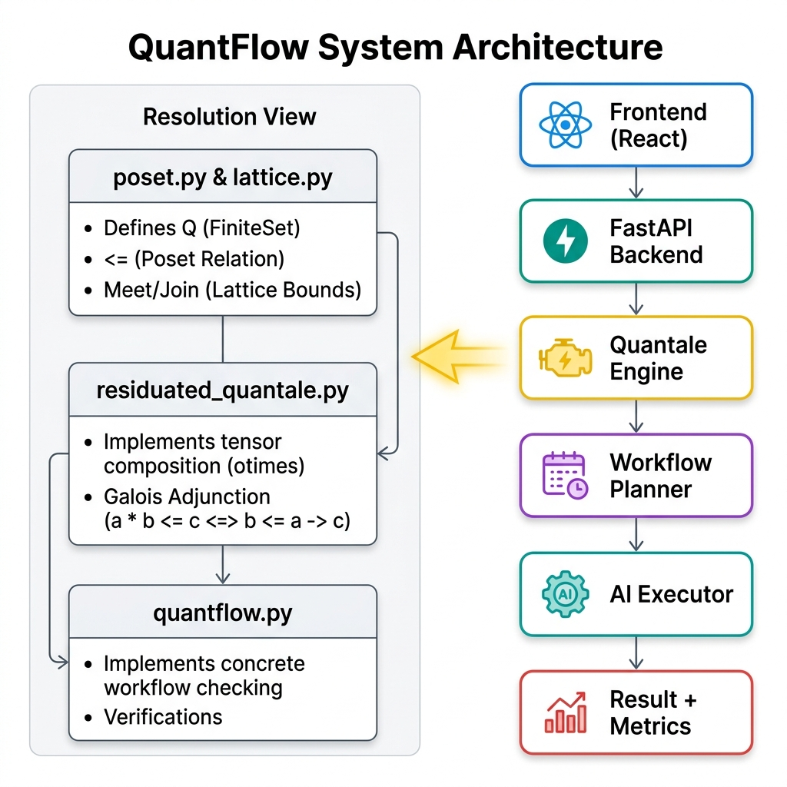
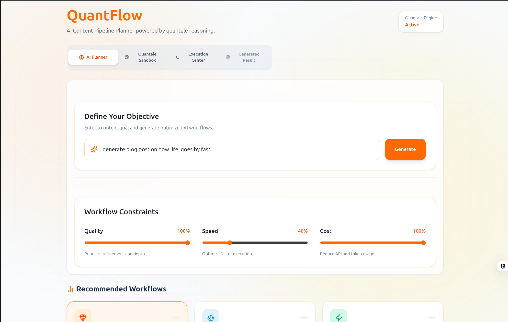
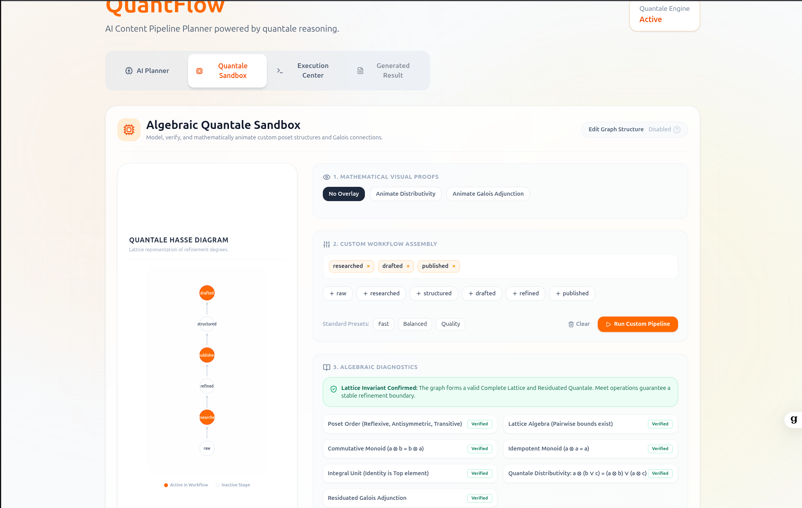

# QuantFlow 🌀

QuantFlow is a mathematically-guaranteed AI workflow orchestration platform.It combines **Abstract Algebra — particularly Residuated Quantales and Lattice Theory — with AI workflow orchestration** to verify safety constraints, optimize execution flows, and detect bottlenecks before sending requests to the Groq API.

---

## Platform Tour

###  System Architecture & Quantale Resolution
How the React frontend, FastAPI backend, and Groq LLM pipelines interact, with a resolution view of the algebraic validation engine:


### Main Executive Dashboard
Specify goals, adjust quality/speed/cost trade-offs, get recommended workflow structures, and see real-time pipeline execution outputs:


### 3. Algebraic Quantale Sandbox
Interactively model Hasse diagrams, edit graph structures, and animate formal Galois Adjunction proofs in real time:


---

##  The Core Concept 

In traditional systems, AI chains are constructed ad-hoc. QuantFlow models stages (e.g. `raw -> researched -> published`) as a **Complete Lattice**:
*   **Lattice Meet ($\wedge$)**: Automatically calculates the strict quality ceiling/bottleneck of a custom workflow.
*   **Galois Adjunction ($a \otimes b \le c \iff b \le a \to c$)**: Enforces safety. If you set a context $a$ and target limit $c$, it computes the maximum safe delegation step $b$ that won't violate quality thresholds.

---


## ⚡ Quick Start

### 1. Start Backend Server
Create a `.env` file in the `backend/` directory:
```env
groq_api=your_groq_api_key
```

Then install dependencies and run:
```bash
cd backend
pip install -r requirements.txt
python main.py
```

### 2. Start Frontend Dev Client
```bash
cd frontend
npm install
npm run dev
```
